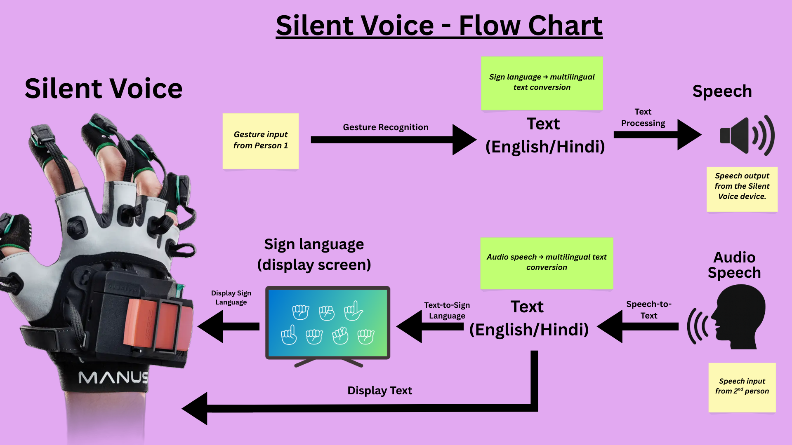

# Silent-Voice 🤫📢

**A gesture-to-speech conversion system using IMU-based hand tracking and machine learning**

## Overview

Silent-Voice is an innovative project that recognizes hand gestures using Inertial Measurement Unit (IMU) sensors mounted on each finger and converts them into spoken words. This system bridges the gap between gestures and communication, leveraging deep learning and speech synthesis technologies.

### Key Features

- **5-Finger IMU Tracking**: Real-time hand gesture capture using MPU6050/MPU9250 sensors
- **Machine Learning Gesture Recognition**: Predicts alphabets and words from finger positions
- **Multi-language Support**: English and Hindi language processing
- **Speech-to-Text**: Real-time speech recognition using Faster-Whisper
- **Text-to-Speech**: Natural speech synthesis using VITS model
- **I2C Communication**: Multiplexed sensor communication via TCA9548A
- **Real-time Processing**: Live gesture capture and conversion with minimal latency

---

## Hardware Requirements

| Component | Purpose | Quantity |
|-----------|---------|----------|
| MPU6050 / MPU9250 | 6-axis IMU (Accel + Gyro) | 5 (one per finger) |
| TCA9548A | I2C Multiplexer | 1 |
| Microcontroller | ESP32 / MicroPython Board | 1 |
| Audio Device | Microphone & Speaker | 1 |

### Pinout Configuration
- **I2C SDA**: Pin 21
- **I2C SCL**: Pin 22
- **TCA9548A Address**: 0x70

---

## Software Architecture

### Core Modules

#### Sensor & IMU Processing
- **`mpu6050.py`** / **`mpu9250.py`** - Low-level sensor drivers
- **`imu.py`** - High-level IMU interface with complementary filtering
- **`tca9548a.py`** - I2C multiplexer control
- **`full_hand_prototype1.py`** - Main integration with 5-finger tracking

#### Gesture Recognition
- **`predict.py`** - Alphabet prediction from finger vectors using trained ML model
- **`mpu6050_test.py`** / **`mpu9250_test.py`** / **`test_tca9548a.py`** - Testing utilities

#### Speech Processing
- **`speech_to_text.py`** - Real-time speech recognition using Faster-Whisper
- **`tts_engine.py`** - Text-to-speech server using VITS model
- **`realtime_voice.py`** - Real-time voice processing pipeline

#### Language Support
- **`middleware.py`** - English text processing
- **`middleware_hi.py`** - Hindi text processing
- **`hindi.py`** - Hindi language utilities

#### Additional
- **`receiver.py`** - Network communication module
- **`voice.py`** - Voice processing utilities

### Data
- **`data/finger_data.txt`** - Training/calibration data for finger gestures
- **Models**:
  - `silent_voice_model.pkl` - Trained gesture recognition model
  - `label_encoder.pkl` - Label encoder for gesture classes

---

## System Architecture Diagram



## Technical Approach Diagram


---

## Installation

### Prerequisites
- Python 3.10+
- CUDA-capable GPU (recommended for faster processing)
- Audio input/output devices

### Setup

1. **Clone the repository**
   ```bash
   git clone <repository-url>
   cd Silent-Voice
   ```

2. **Create virtual environment**
   ```bash
   python -m venv venv310
   source venv310/bin/activate  # On Windows: venv310\Scripts\activate
   ```

3. **Install dependencies**
   ```bash
   pip install -r requirements.txt
   ```

### Key Dependencies
- `faster-whisper` - Speech recognition
- `TTS` - Text-to-speech synthesis
- `numpy`, `scipy` - Numerical computing
- `sounddevice`, `soundfile` - Audio I/O
- `joblib` - Model serialization
- `torch` - Deep learning framework
- `scikit-learn` - Machine learning

---

## Usage

### 1. **Real-time Gesture Recognition**
```bash
python full_hand_prototype1.py
```
Captures hand gestures from 5 IMU sensors and predicts corresponding alphabets.

### 2. **Speech-to-Text**
```bash
python speech_to_text.py
```
Records and transcribes speech in real-time.

### 3. **Text-to-Speech**
```bash
python tts_engine.py
```
Starts a TCP server (localhost:5000) that converts text input to speech.

### 4. **Real-time Voice Processing**
```bash
python realtime_voice.py
```
Integrated pipeline for real-time voice capture and processing.

### 5. **Gesture Prediction**
```bash
python predict.py
```
Interactive tool to predict gestures from finger vector data.

**Input format**: 15 comma-separated float values
```
thumb_x,thumb_y,thumb_z,index_x,index_y,index_z,
middle_x,middle_y,middle_z,ring_x,ring_y,ring_z,
pinky_x,pinky_y,pinky_z
```

---

## System Workflows

### Gesture-to-Speech Pipeline
```
IMU Sensors → TCA9548A Multiplexer → I2C Controller
    ↓
IMU Processing (accel, gyro) → Normalize Vectors
    ↓
ML Model (predict.py) → Gesture Classification
    ↓
Text → TTS Engine (tts_engine.py) → Audio Output
```

### Speech-to-Text Pipeline
```
Microphone → Audio Recording → Faster-Whisper
    ↓
Text Transcription → Language Processing (Middleware)
    ↓
Output (English/Hindi)
```

---

## IMU Sensor Data

### Accelerometer (Accel)
- **Measurement**: Linear acceleration on X, Y, Z axes
- **Units**: g (gravitational units)
- **Threshold Example**:
  ```python
  ax, ay, az = mpu.get_accel()
  if ax > 0.2:
      print("RIGHT")
  elif ax < -0.2:
      print("LEFT")
  ```

### Gyroscope (Gyro)
- **Measurement**: Angular velocity
- **Units**: degrees/second

### Magnetometer (Mag) - MPU9250 only
- **Measurement**: Magnetic field strength
- **Units**: μT (microtesla)
- **Purpose**: Heading/Yaw calculation

### Complementary Filter
The `IMU` class implements a complementary filter for robust orientation estimation:
```python
orientation = alpha * (gyro_integrated) + (1-alpha) * (accel_based)
```
Default alpha = 0.98 (99.5% gyro trust, 0.5% accel correction)

---

## Configuration

### I2C Settings
```python
i2c = I2C(0, scl=Pin(22), sda=Pin(21), freq=100000)
```

### Sensor Addresses
- **MPU6050/MPU9250**: 0x68 (standard) or 0x69 (alternate)
- **TCA9548A**: 0x70

### TTS Server
```
HOST: 127.0.0.1
PORT: 5000
```

---

## Testing

Run unit tests for sensor modules:
```bash
python mpu6050_test.py
python mpu9250_test.py
python test_tca9548a.py
```

---

## Troubleshooting

### I2C Communication Issues
- Check sensor connections and pull-up resistors
- Run `i2c_recover()` in `full_hand_prototype1.py`
- Verify TCA9548A address (0x70)

### CUDA/GPU Issues
```bash
python voice.py  # Check GPU availability
```

### Audio Issues
- Verify audio device selection in `speech_to_text.py`
- Check system audio input/output settings

---

## Project Structure

```
Silent-Voice/
├── Core Modules
│   ├── full_hand_prototype1.py      # Main 5-finger integration
│   ├── imu.py                        # IMU abstraction layer
│   ├── mpu6050.py / mpu9250.py      # Sensor drivers
│   ├── tca9548a.py                   # I2C multiplexer
│   └── predict.py                    # ML gesture recognition
├── Speech Modules
│   ├── speech_to_text.py             # Speech recognition
│   ├── tts_engine.py                 # Text-to-speech server
│   └── realtime_voice.py             # Real-time processing
├── Language Support
│   ├── middleware.py                 # English processing
│   ├── middleware_hi.py              # Hindi processing
│   └── hindi.py                      # Hindi utilities
├── Testing & Utilities
│   ├── mpu6050_test.py / mpu9250_test.py
│   ├── test_tca9548a.py
│   ├── receiver.py
│   └── voice.py
├── Data
│   └── data/finger_data.txt          # Training data
├── Models
│   ├── silent_voice_model.pkl        # Trained model
│   └── label_encoder.pkl             # Label encoder
├── Virtual Environment
│   └── venv310/                      # Python 3.10 environment
└── README.md / .gitignore
```

---

## Performance Notes

- **Gesture Recognition**: ~15-30ms latency with CPUs, <5ms with GPU acceleration
- **Speech Recognition**: Real-time with Faster-Whisper Small model
- **Audio Output**: 22050 Hz sample rate for TTS
- **I2C Frequency**: 100 kHz for stable multi-sensor communication

---

## Future Enhancements

- [ ] Wireless IMU sensor transmission (Bluetooth/WiFi)
- [ ] Continuous gesture recognition (sequence learning)
- [ ] Multi-language gesture support
- [ ] Mobile app integration
- [ ] Gesture recording and training interface
- [ ] Advanced gesture filtering and noise reduction

---

## Contributing

Contributions are welcome! Please follow these guidelines:
1. Create a feature branch
2. Test thoroughly on hardware
3. Update documentation
4. Submit a pull request

---

## License

[Add your license here]

---

## Contact & Support

For issues, questions, or suggestions, please open an Issue in the repository.

---

**Built for accessibility and human-computer interaction** 🤝
